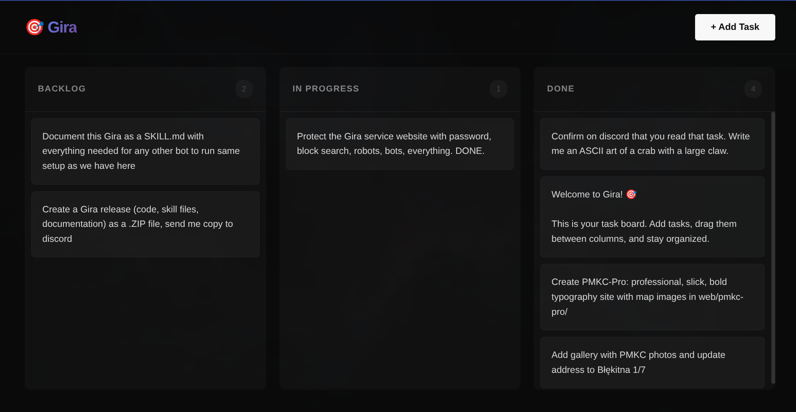

# Gira - Lightweight Task Board

A simple, self-hosted kanban board for managing tasks between humans and AI agents.




## Quick Start

```bash
# 1. Create directories
mkdir -p gira/data/{backlog,in-progress,done} gira/public

# 2. Copy files
cp server.js gira/
cp index.html gira/public/
cp package.json gira/

# 3. Install and run
cd gira
npm install
node server.js

# 4. Open browser
# http://localhost:8888
# Default login: gira / gira
```

## Files

- `server.js` - Express backend with auth
- `index.html` - Web UI (copy to public/)
- `SKILL.md` - Full documentation
- `package.json` - Node dependencies

## Security

CHANGE THE PASSWORD in server.js before deploying!

```javascript
const AUTH_USER = 'gira';
const AUTH_PASS = 'YOUR-SECURE-PASSWORD-HERE';
```

## License

MIT
